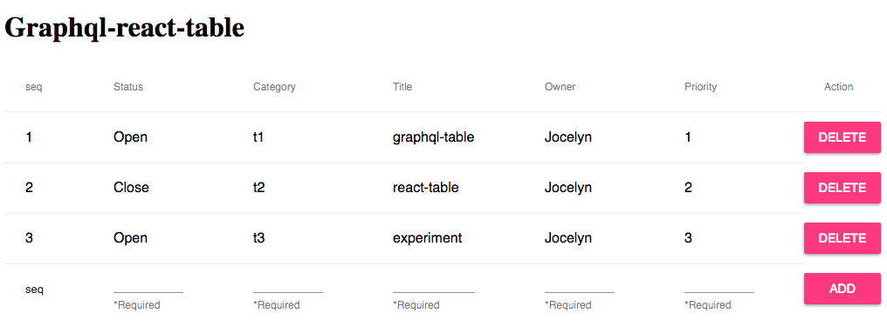

# graphql-react-table
Using graphql to Creat-Read-Update-Delete table.

## Features
- Webpack
- Mongodb
- React
- Redux
- Express + GraphQL
- Jest

## Screenshot


## Environment setup
1. Setup Mongodb(dbname: issue, collection name: issuelist)
2. clone the code
```Shell
$ git clone https://github.com/xu3u4/graphql-react-table.git
cd graphql-express-react
$ npm install (or yarn install)
```
3. Start the app
  - `mongod` (Enter mongodb)
  - `npm run start` (Start express server)
  - `npm run dev` (Run application)